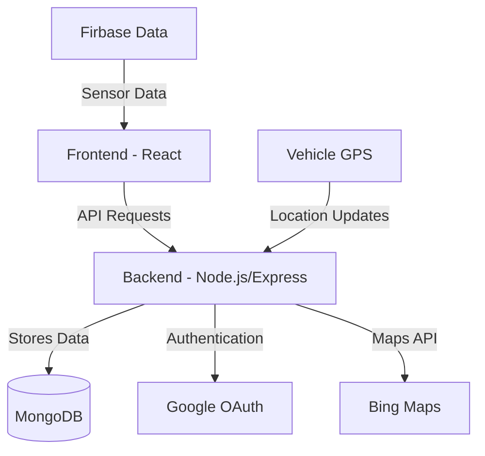
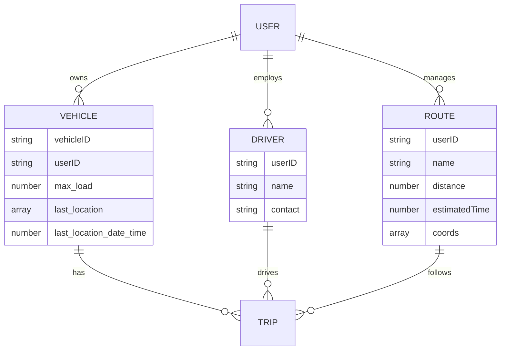
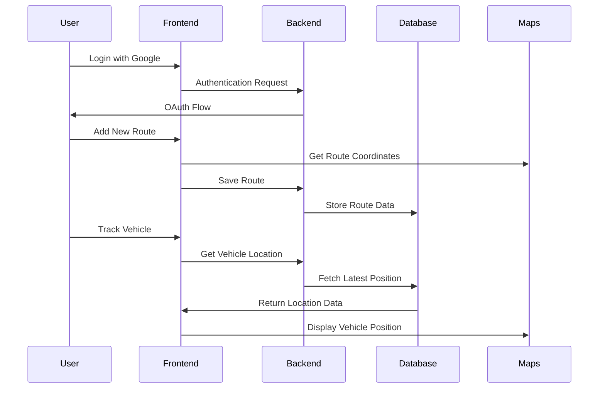

# Fleet Management System - Securo 🚚

A comprehensive fleet management solution for tracking vehicles, managing routes, and monitoring drivers in real-time.

## Features 🌟

- 🗺️ Real-time vehicle tracking using Bing Maps
- 🛣️ Route creation and management 
- 👥 Driver management system
- 🚛 Vehicle fleet management
- ⚠️ Real-time alerts and monitoring
- 📊 Dashboard analytics
- 🔐 Google OAuth authentication
- 🌐 Geofencing capabilities

## Architecture 🏗️



## Data Models 📊



## Tech Stack 💻

- **Frontend:**
  - React.js
  - React Router DOM
  - Bing Maps API
  - CSS3

- **Backend:**
  - Node.js
  - Express.js
  - MongoDB/Mongoose
  - Passport.js (Google OAuth)

## Setup Instructions 🚀

1. Clone the repository
\`\`\`bash
git clone <repository-url>
\`\`\`

2. Install dependencies
\`\`\`bash
# Install backend dependencies
cd Backend
npm install

# Install frontend dependencies
cd ../Frontend
npm install
\`\`\`

3. Environment Setup

   **Backend Environment (.env file in Backend directory)**
   ```env
   MONGODB_URI=<your-mongodb-uri>
   MONGODB_DB_NAME=Securo
   GOOGLE_CLIENT_ID=<your-google-client-id>
   GOOGLE_CLIENT_SECRET=<your-google-client-secret>
   APP_URL=<your-app-url>
   ```

   **Frontend Environment (.env file in Frontend directory)**
   ```env
   REACT_APP_API_URL=http://localhost:4000
   REACT_APP_BINGMAP_API_KEY=<your-bing-maps-api-key>
   ```

4. Running the Project

   **Development Mode**
   \`\`\`bash
   # Start Backend Server (Terminal 1)
   cd Backend
   npm install
   npm run dev  # Runs with nodemon for development

   # Start Frontend Server (Terminal 2)
   cd Frontend
   npm install
   npm start    # Runs on http://localhost:3000
   \`\`\`

   **Production Mode**
   \`\`\`bash
   # Build Frontend
   cd Frontend
   npm run build

   # Start Backend Server
   cd Backend
   npm start    # Runs on port 4000
   \`\`\`

   **Order of Operations**
   1. Start MongoDB service on your machine
   2. Start the Backend server
   3. Start the Frontend development server
   4. Access the application at http://localhost:3000

   **Common Commands**
   \`\`\`bash
   # Install dependencies
   npm install    # Run in both Backend and Frontend directories

   # Development with hot reload
   npm run dev    # Backend
   npm start      # Frontend

   # Production build
   npm run build  # Frontend
   npm start      # Backend

   # Run tests
   npm test       # Available for both Frontend and Backend
   \`\`\`

## Features Flow 🔄



## Development Guide 👨‍💻

1. **File Structure:**
   - `/Frontend` - React application files
   - `/Backend` - Node.js/Express server files
   - `/Backend/models` - Database schemas
   - `/Backend/routes` - API routes
   - `/Backend/middleware` - Custom middleware

2. **Key Components:**
   - `Dashboard.js` - Main tracking interface
   - `FleetManagement.js` - Vehicle management
   - `AddRoute.js` - Route creation
   - `monitorVehicles.js` - Vehicle monitoring system

3. **API Endpoints:**
   - `/auth/*` - Authentication routes
   - `/routes/*` - Route management
   - `/drivers/*` - Driver management
   - `/vehicles/*` - Vehicle management
   - `/trips/*` - Trip management
   - `/simulation/*` - Simulation endpoints

## Monitoring System ⚙️

The system includes an automated monitoring service that:
- Checks vehicle positions every 10 seconds
- Generates alerts for any anomalies
- Tracks vehicle movements against defined routes
- Monitors geofence boundaries

## Contributing 🤝

1. Fork the repository
2. Create your feature branch (`git checkout -b feature/AmazingFeature`)
3. Commit your changes (`git commit -m 'Add some AmazingFeature'`)
4. Push to the branch (`git push origin feature/AmazingFeature`)
5. Open a Pull Request

## License 📝

This project is licensed under the MIT License - see the LICENSE file for details.
